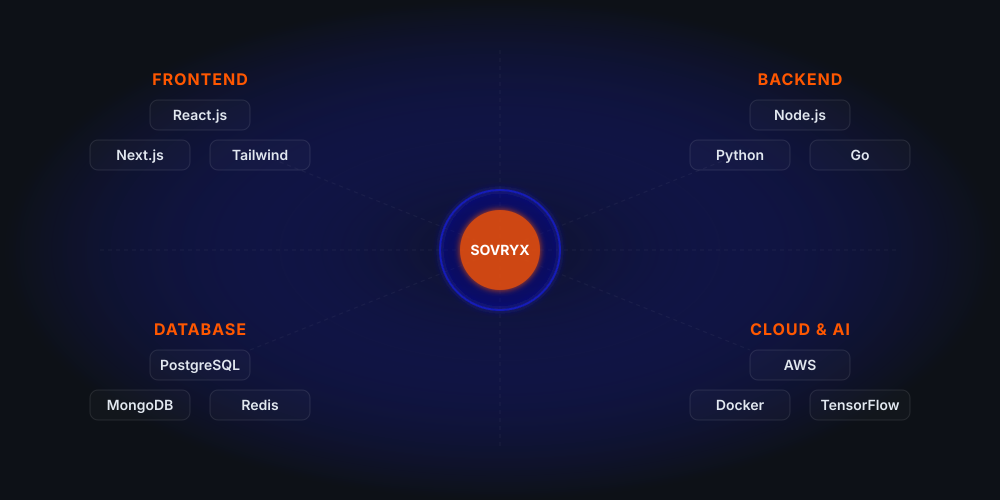

  <!-- Custom Hero Banner -->
  <picture>
    <source media="(prefers-color-scheme: dark)" srcset="./assets/hero-banner.svg">
    <source media="(prefers-color-scheme: light)" srcset="./assets/hero-banner.svg">
    
  </picture>

 

  
  
  
  

 

## 🌌 The Vision & Identity

<table>
  <tr>
    <td width="50%" valign="top">
      <h3>I build the future of the web.</h3>
      
I am a visionary <b>Software Engineer, AI Developer, and SaaS Builder</b> with a relentless drive for innovation. As the Founder & CEO of Sovryx Tech Pvt. Ltd., my mission is to drive digital transformation across South Asia through accessible, affordable, and cutting-edge technology.

      
<i>"Innovation is not just about adopting the latest technology; it's about solving real-world problems with elegance, scalability, and seamless user experiences."</i>

    </td>
    <td width="50%" valign="top">
      <h3>About Sovryx Tech</h3>
      
<b>Mission:</b> Making Nepal Digital Through Affordable Technology.

      
Sovryx Tech is a modern technology powerhouse specializing in ERP systems, Smart IoT Solutions, AI integrations, and tailored software products engineered for enterprise success.

      
    </td>
  </tr>
</table>

 

## 📊 Personal Dashboard

  

 

## ⚡ Technology Ecosystem

  

 

## 🌟 Featured Engineering Projects

  
<b>1. 🔐 Smart Door Security System</b>

   
  <table>
    <tr>
      <td width="35%" valign="top">
        
      </td>
      <td width="65%" valign="top">
        <b>Description:</b> Next-generation automated door security utilizing real-time facial recognition and IoT sensors for enterprise-grade access control.  
        <b>Features:</b> Face Detection, Activity Logging, Remote Unlock, Threat Alerts.  
        <b>Technologies:</b>      
        <b>Status:</b>  &nbsp;|&nbsp;  &nbsp;|&nbsp; 
      </td>
    </tr>
  </table>

  
<b>2. 🧑‍💻 Facial Attendance System</b>

   
  <table>
    <tr>
      <td width="35%" valign="top">
        
      </td>
      <td width="65%" valign="top">
        <b>Description:</b> AI-driven attendance tracking system designed for corporate environments and educational institutions to ensure seamless monitoring.  
        <b>Features:</b> Spoof Detection, Automated Reporting, Dashboard Analytics, Cloud Sync.  
        <b>Technologies:</b>     
        <b>Status:</b>  &nbsp;|&nbsp;  &nbsp;|&nbsp; 
      </td>
    </tr>
  </table>

  
<b>3. 💧 Smart Water Management System (SWMS)</b>

   
  <table>
    <tr>
      <td width="35%" valign="top">
        
      </td>
      <td width="65%" valign="top">
        <b>Description:</b> IoT-based infrastructure for real-time water level monitoring, leak detection, and automated pump control to conserve resources.  
        <b>Features:</b> Flow Analytics, Mobile Alerts, Pump Automation, Conservation Metrics.  
        <b>Technologies:</b>     
        <b>Status:</b>  &nbsp;|&nbsp;  &nbsp;|&nbsp; 
      </td>
    </tr>
  </table>

  
<b>4. 📊 Sovryx ERP & Business OS</b>

   
  <table>
    <tr>
      <td width="35%" valign="top">
        
      </td>
      <td width="65%" valign="top">
        <b>Description:</b> Comprehensive enterprise resource planning suite tailored for modern businesses to manage HR, Finance, and Operations in one hub.  
        <b>Features:</b> Modular Architecture, RBAC, Financial Forecasting, Payroll.  
        <b>Technologies:</b>     
        <b>Status:</b>  &nbsp;|&nbsp;  &nbsp;|&nbsp; 
      </td>
    </tr>
  </table>

  
<b>5. 🍽️ Restaurant QR Ordering System</b>

   
  <table>
    <tr>
      <td width="35%" valign="top">
        
      </td>
      <td width="65%" valign="top">
        <b>Description:</b> Contactless dining experience platform featuring digital menus, direct kitchen routing, and instant integrated billing.  
        <b>Features:</b> Dynamic QR Generation, Payment Gateway, Table Management.  
        <b>Technologies:</b>     
        <b>Status:</b>  &nbsp;|&nbsp;  &nbsp;|&nbsp; 
      </td>
    </tr>
  </table>

  
<b>6. 🏫 School Management System</b>

   
  <table>
    <tr>
      <td width="35%" valign="top">
        
      </td>
      <td width="65%" valign="top">
        <b>Description:</b> Complete administration portal for academic institutions streamlining student records, staff payroll, and curriculum management.  
        <b>Features:</b> Gradebook, Parent Portal, Attendance, Fee Tracking.  
        <b>Technologies:</b>     
        <b>Status:</b>  &nbsp;|&nbsp;  &nbsp;|&nbsp; 
      </td>
    </tr>
  </table>

  
<b>7. 📦 Inventory & Billing System</b>

   
  <table>
    <tr>
      <td width="35%" valign="top">
        
      </td>
      <td width="65%" valign="top">
        <b>Description:</b> Real-time stock tracking, invoicing, and sales analytics platform designed for high-volume retail and wholesale operations.  
        <b>Features:</b> Barcode Scanning, Supplier Management, Profit Analytics.  
        <b>Technologies:</b>     
        <b>Status:</b>  &nbsp;|&nbsp;  &nbsp;|&nbsp; 
      </td>
    </tr>
  </table>

  
<b>8. 🤝 CRM System</b>

   
  <table>
    <tr>
      <td width="35%" valign="top">
        
      </td>
      <td width="65%" valign="top">
        <b>Description:</b> Customer relationship management tool engineered to streamline sales pipelines, lead conversions, and customer support tickets.  
        <b>Features:</b> Email Campaigns, Pipeline Visualization, Task Automation.  
        <b>Technologies:</b>     
        <b>Status:</b>  &nbsp;|&nbsp;  &nbsp;|&nbsp; 
      </td>
    </tr>
  </table>

  
<b>9. 👨‍💼 Portfolio Website</b>

   
  <table>
    <tr>
      <td width="35%" valign="top">
        
      </td>
      <td width="65%" valign="top">
        <b>Description:</b> Premium developer portfolio crafted with cinematic 3D elements, smooth page transitions, and an elegant dark mode aesthetic.  
        <b>Features:</b> SEO Optimized, Framer Motion, Responsive Grid.  
        <b>Technologies:</b>     
        <b>Status:</b>  &nbsp;|&nbsp;  &nbsp;|&nbsp; 
      </td>
    </tr>
  </table>

  
<b>10. 🌐 Sovryx Tech Website</b>

   
  <table>
    <tr>
      <td width="35%" valign="top">
        
      </td>
      <td width="65%" valign="top">
        <b>Description:</b> Official corporate digital presence featuring glassmorphism design language, fast load times, and interactive service modules.  
        <b>Features:</b> Lead Generation, Blog Integration, Custom Animations.  
        <b>Technologies:</b>     
        <b>Status:</b>  &nbsp;|&nbsp;  &nbsp;|&nbsp; 
      </td>
    </tr>
  </table>

 

## 📈 Engineering Analytics

  
  

 

  
  

 

  

 

  <h3>🐍 Contribution Snake</h3>
  <picture>
    <source media="(prefers-color-scheme: dark)" srcset="https://raw.githubusercontent.com/mohitshrestha-dev/mohitshrestha-dev/output/github-contribution-grid-snake-dark.svg">
    <source media="(prefers-color-scheme: light)" srcset="https://raw.githubusercontent.com/mohitshrestha-dev/mohitshrestha-dev/output/github-contribution-grid-snake.svg">
    
  </picture>

 

## ⚡ Recent Code Activity

<!--START_SECTION:activity-->
<!--END_SECTION:activity-->

 

## 🏆 Credentials & Support

<table>
  <tr>
    <td width="50%" align="center">
      <h3>Achievements</h3>
        
        
        
      
    </td>
    <td width="50%" align="center">
      <h3>Sponsorship</h3>
        
        
      
    </td>
  </tr>
</table>

 

  
  
  
  

 

  <i>"Code is poetry written in logic, and every scalable product is a masterpiece."</i>
    
  

